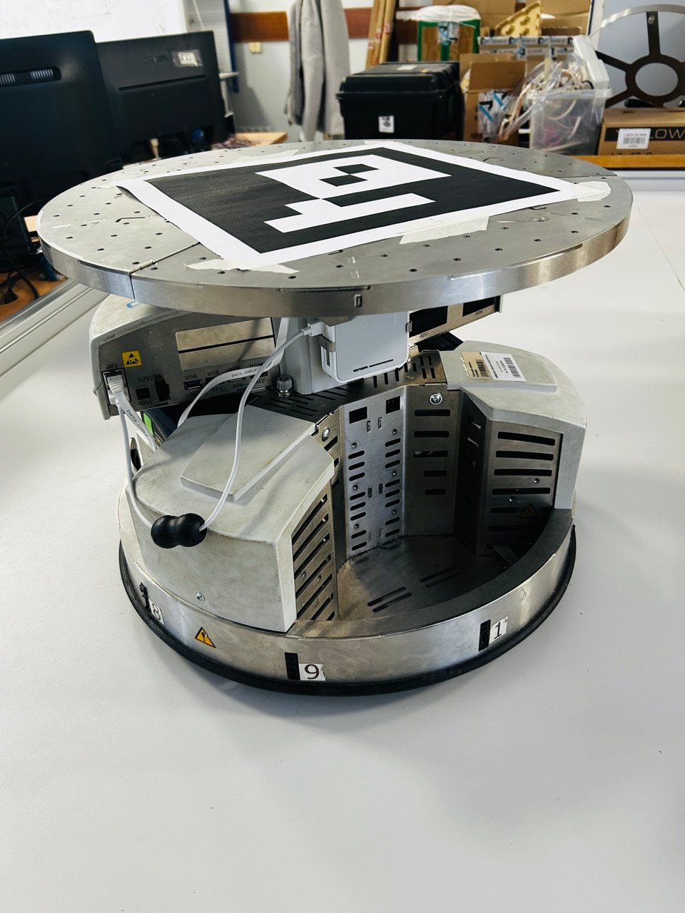
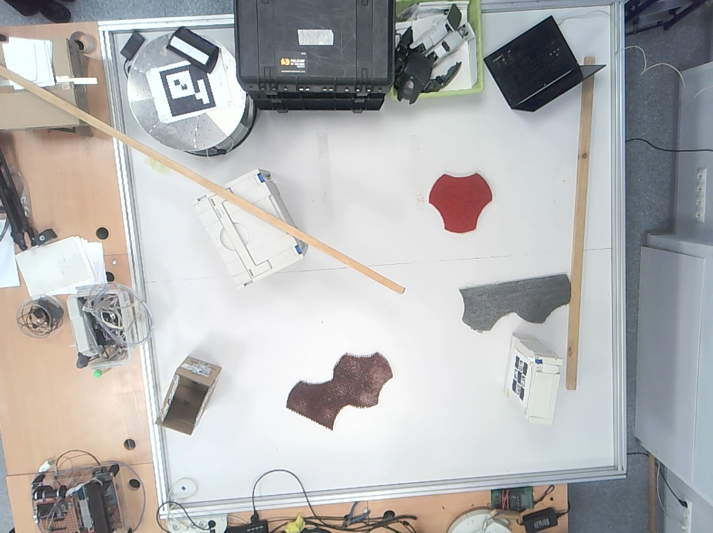
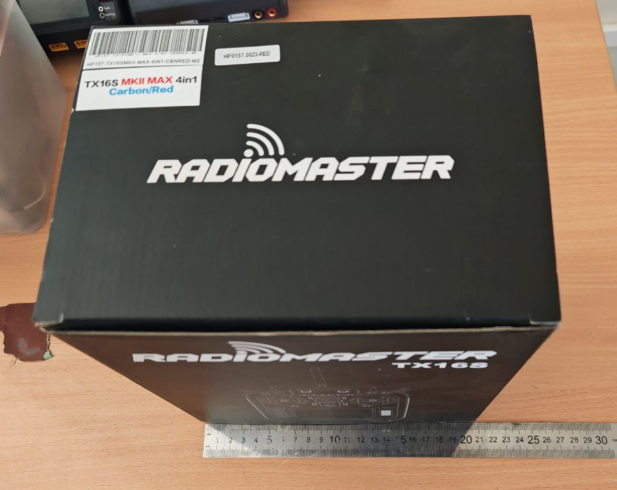
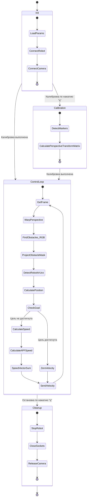

# Краткое описание репозитория

В данном репозитории находятся скрипты для управления мобильной робототехниеской системой [Festo Robotino](https://ip.festo-didactic.com/Infoportal/robotino/Overview/EN/index.html) в рамках решения заданий дисциплины "Мобильные роботы".

# Как загрузить репозиторий и использовать на своей машине?

## 1. Клонирование репозитория

Скопируйте репозиторий на свой локальный компьютер с помощью Git. Откройте терминал и выполните команду:
```bash
git clone https://github.com/Georgius03/mag_Mobile_robots.git
```

После завершения клонирования перейдите в директорию проекта:
```bash
cd mag_Mobile_robots
```

## 2. Настройка окружения

Убедитесь, что у вас установлен Python 3.x. (у меня окружение на python 3.10.11) Рекомендуется создать и активировать виртуальное окружение для изоляции зависимостей проекта:
```bash
# Создание виртуального окружения
python -m venv venv
# Активация окружения
.\venv\Scripts\activate
```

Затем установите необходимые библиотеки.
```bash
# Установка всех библиотек одной командой
pip install -r requirements.txt
```

## 3. Настройка параметров системы
Все ключевые параметры для работы скриптов собраны в файле parameters.yaml. Вам необходимо отредактировать этот файл под свою конфигурацию:
- IP-адрес робота: В блоке socket_params измените значение IP_ADDRESS на адрес вашего робота Festo Robotino (по умолчанию стоит '192.168.0.1').
- Расположение маркеров: В блоке aruco укажите ID ваших ArUco-маркеров, соответствующих углам полигона (левый верхний, правый верхний и т.д.).
- Параметры движения: При необходимости отрегулируйте max_speed, k_prop и другие параметры в блоках move и apf (поле потенциальных функций).
- Тестирование: Если вы хотите запустить скрипты без подключения к реальному роботу (используя видео), в блоке socket_params установите enable: 0. Это позволит проверить логику работы с компьютерным зрением на видеоряде.

## 4. Запуск скриптов
Репозиторий содержит три основных скрипта, соответствующих трем задачам:

### Задача 1 [(объезд препятствия)]:
Запуск скрипта [main_1.py](main_1.py) осуществляется следующей командой:
```bash
python main_1.py
```

`На открывшемся окне при нажатии ЛКМ устанавливается целевая точка`

### Задачи 2 и 3 (планирование маршрута):
Обратите внимание, что внутри скрипта [main_2_3.py](main_2_3.py), реализованы алгоритмы как для статических (задача 2), так и для динамических (задача 3) препятствий.

`Аналогично предыдущему скрипту, на открывшемся окне при нажатии ЛКМ устанавливается целевая точка`

`Для переключения между статическим и динамическим режимом используйте ПКМ`
```bash
python main_2_3.py
```

Вспомогательный скрипт: [color_picker.py](color_picker.py) может использоваться для подбора цветовых диапазонов при сегментации препятствий.
```bash
python color_picker.py
```

## 5. Подготовка физической среды
Перед запуском убедитесь, что ваша экспериментальная установка соответствует описанной далее в README:
- Над полигоном установлена и подключена к компьютеру веб-камера.
- На полигоне по углам размещены ArUco маркеры 5x5 с начальными точками привязки [0][0] расположенными в такой же ориентации, что и [0][0] изображения.
- В `parameters.yaml` указан правильный порядок ArUco маркеров.
- На роботе закреплен ArUco-маркер 6x6.
- Препятствия (например, цветные коробки) расставлены на полигоне.
- Робот включен и находится в одной сети с вашим компьютером.
- В случае возникновения проблем с подключением к камере или роботу, проверьте параметры в файле parameters.yaml и доступность устройств в вашей системе.

---

# Перечень заданий к исполнению

## Задача №1

> [!NOTE]
> Обеспечить автономное движение робота из точки A в точку Б с учётом возможного нахождения препятствия на пути следования.

> [!IMPORTANT]
> *Примечание: Обеспечение обхода препятствия (object avoidance) может быть реализовано при помощи любого алгоритма обхода препятствий.*

## Задача №2

> [!NOTE]
> Обеспечить автономное движение робота из точки A в точку Б по заранее сформированному маршруту при помощи планировщика движения с учётом нахождения на испытательном полигоне статических препятствий.

> [!IMPORTANT]
> *Примечание: Необходимо апробировать 3 различных алгоритма планирования маршрута робота, приветси рисунки и сравнительную таблицу для полученных маршрутов.*

## Задача №3

> [!NOTE]
> Обеспечить автономное движение робота из точки A в точку Б по динамически формирующемуся маршруту при помощи планировщика движения с учётом нахождения на испытательном полигоне динамических препятствий.

> [!IMPORTANT]
> *Примечание: Необходимо апробировать 3 различных алгоритма планирования маршрута робота.*

---

# Реализация

## Подготовка инфраструктуры
### Описание испытательного полигона и используемой **МРС**

Испытательный полигон представлят собой плоскость квадратной формы с длиной стороны $A=2200 \, мм$.

Мобильная робототехниеская система **Festo Robotino** имеет размеры: Диаметр $D=450 \, мм$ что является $\approx \frac{1}{5}$ от длины полигона, а высота $h=370 \, мм$. Управление данным роботм возможно осуществить при помощи среды Robotino View, однако в контексте данной работы ввиду работы с внешней камерой решено осуществлять коммуникацию через socket, и отправлять линейные скорости для движения на веб-сервис.



Также над полигоном установлена веб-камера, к которой возможно подключиться по USB.



Учитывая возможность подключения к камере в рамках данной работы, решено отслеживать положение робота на полигоне при помощи ArUco маркера. Достоинством такого метода по отношению к расчёту при помощи одометрии, является гарантированное определение положение робота на полигоне с отсутствием накапливающейся ошибки от энкодеров при возникновении проскальзывания колёс.

### Подготовка препятствий

Ввиду отсутствия описания объектов используемых в качестве препятствий, были выбраны и подготовлены свои собственные препятствия в количестве 5 шт.

Учитывая отношение размеров робота к полигону было решено использовать малогабиритные коробки из под пультов RadioMaster TX16S.



Ввиду наличия на полигоне линий из изоленты чёрного цвета, решено отделить объекты от фона при помощи яркого насыщенного цвета с заделом на дальнейшее использование компьютерного зрения во всех решениях поставленных задач. При использовании цветного картона важно выбрать матовую поверхность для избежания бликов от солнца из окна, а также учесть возможные засветы и выбрать наиболее контрастные цвета. В двнной рабое использован картон красного, зелёного и синего цвета, соотстветственно именно под эти цвета формируется маска с препятствиями.

### Параметры системы
Параметры, используемые в скриптах собраны в единый файл [`parameters.yaml`](parameters.yaml) для упрощения отладки и повышения читаемости кода.

Блок настройки параметров подключения к веб-сервису
```yaml
socket_params:                 # Параметры подключения к роботу
  IP_ADDRESS: '192.168.0.1'        # IP SocketServer
  PORT: 80                         # Порт SocketServer
  enable: 1                        # Отк./вкл. для тестирования (0/1) чтобы не производилось подключение к роботу
```

Блок задания порядка расположения ArUco маркеров для калибровки камеры
```yaml
aruco:                         # Очерёдность размещения ArUco маркеров на полигоне
  left_up: 0                       # Левый верхний
  right_up: 5                      # Правый верхний
  right_down: 3                    # Правый нижний
  left_down: 4                     # Левый нижний
```

Блок задания параметров движения робота
```yaml
move:                          # Параметры движения работа
  dist_stop: 50                    # Расстояние для остановки при движении к точке (мм)
  max_speed: 0.08                  # Максимальная скорость Robotino (м/с)
  k_prop: 1.0                      # Пропорциональный коэффициент 
```

Параметры потенциального поля
```yaml
apf:                           # Параметры для потеницального поля Atrificial Potential Field
  d0: 100                          # Радиус влияния препятствия (px)
  influence_radius: 390            # Радиус влияния препятствия (px)
  scale_factor: 1                  # Коэффициент уменьшения изображения (для ускорения вычислений при необходимости [0-1])
  WALL_WIDTH: 1                    # Толщина стенки по контуру рабочего поля (для 1 задачи)
  WALL_WIDTH2: 150                 # Толщина стенки по контуру рабочего поля (для 2-3 задачи)
  k_rep: 4.0e-9                    # Коэффициент отталкивания
```

---

## Написание ПО и отладка
### Решение задачи № 1

Необходимо обеспечить автономное движение робота Festo Robotino из точки А в точку Б с учётом возможного нахождения препятствия на пути следования. Для обнаружения препятствий используется внешняя камера, а для определения положения робота - ArUco-маркер. Система должна гарантированно обнаруживать препятствие и осуществлять его объезд без столкновения, после чего продолжать движение к целевой точке.

Для обхода одного препятствия, которое может находиться на полигоне по маршруту следования робота, возможно использовать один из нескольких алгоритмов реактивного управления. Реактивные методы отличаются тем, что не требуют построения полной карты окружающей среды и принимают решения на основе текущих данных с сенсоров (в данном случае - с камеры), что обеспечивает высокую скорость реакции и низкие вычислительные затраты.

В таблице 1 представлен сравнительный анализ наиболее распространённых реактивных методов объезда препятствий, применимых для решения поставленной задачи.

**Таблица 1. Сравнение реактивных методов обхода препятствий (Obstacle Avoidance)**

| Метод | Принцип работы | Преимущества | Недостатки | Применимость для данной задачи |
| - | - | - | - | - |
|**Bug0** | Движение к цели, пока не встретится препятствие. Затем следование вдоль его границы (обход по контуру), пока движение к цели снова не станет возможным.| • Простота реализации  <br>• Не требует сложных вычислений  <br>• Гарантированно находит путь, если он существует| • Неоптимальный маршрут  <br>• Может зацикливаться в сложных лабиринтах  <br>• Требует точного следования вдоль стены  | Средняя - требует надёжного детектирования касания препятствия |
| **Потенциальные поля (APF)** | Препятствия создают "отталкивающие" силы, а цель - "притягивающую". Робот движется под действием результирующего вектора силы.| • Плавные траектории  <br>• Высокая скорость реакции  <br>• Учёт нескольких препятствий | • Локальные минимумы (робот может застрять)  <br>• Непроходимость в узких коридорах  <br>• Колебания при прохождении в средних коридорах | **Высокая** - реализован в проекте (см. [parameters.yaml](parameters.yaml)) |
| **VFH (Vector Field Histogram)** | Построение локальной сетки ocupancy и создание гистограммы полярных плотностей препятствий. Выбор направления с наименьшей плотностью.| • Учитывает размер робота  <br>• Хорошо работает с шумными данными  <br>• Высокая скорость| • Требует настройки множества параметров  <br>• Сложнее в реализации  <br>• Может "дрожать" на месте| Средняя - требует больше вычислительных ресурсов|
| **Динамические окна (DWA)** | Поиск в пространстве скоростей (линейная и угловая) комбинации, которая максимизирует функцию выгоды (движение к цели, скорость, безопасность).| • Учитывает динамику робота  <br>• Оптимальные гладкие траектории  <br>• Естественное избегание препятствий| • Вычислительно затратен  <br>• Сложная настройка весов  <br>• Локальный оптимум | Средняя - избыточен для одной камеры |
| **Нечёткая логика** | Нечёткое принятие решения о скорости и направлении движения учитывая вложенный в логику опыт разработчиков | • Метод искуственного интеллекта  <br>• Позволяет без серъёзной перенастройки перенести опыт разработчиков сразу же на уровне проектирования базы правил <br>• Имеется множество вариаций использования  | • Вычислительно затратен при большом количестве правил <br>• Наличие локальных минимумов (взаимокомпенсируемых правил), где робот как в APF останавливается <br>| Высокая - ввиду множества вариаций исполнения |

В конечном итоге был выбран APF (Artificial potential field) ввиду сравнительной простоты реализации и меньшей вычислительной сложности по сравнению с нечётой логикой.

Машина состояний в общем виде для решения задачи №1 представлена в виде mermaid диаграммы ниже.



Визуализация примера траектории движения робота через 2 препятствия (изм. изображение с [источника](https://www.mdpi.com/2226-4310/10/6/562))


Визуализация траектории движения робота на реальном полигоне.


---

### Решение задачи № 2


---

### Решение задачи № 3


---

# Ссылки на доп. материалы

- Hao G, Lv Q, Huang Z, Zhao H, Chen W. UAV Path Planning Based on Improved Artificial Potential Field Method. Aerospace. 2023; 10(6):562. https://doi.org/10.3390/aerospace10060562